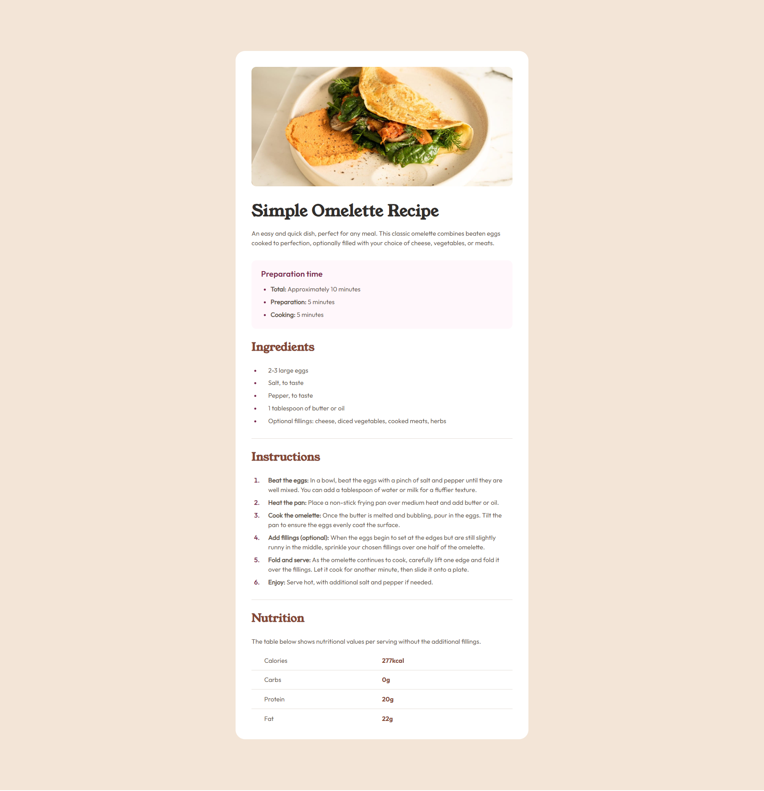
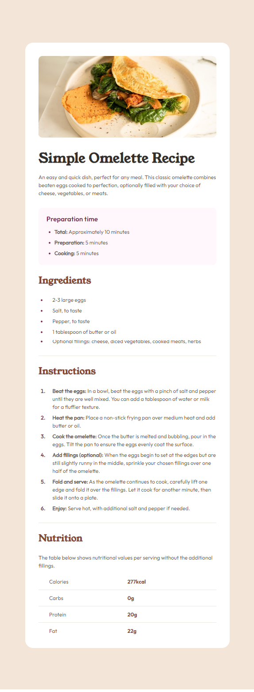
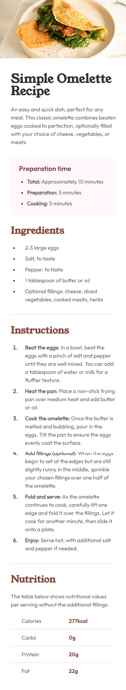

# Frontend Mentor - Recipe page solution

This is a solution to the [Recipe page challenge on Frontend Mentor](https://www.frontendmentor.io/challenges/recipe-page-KiTsR8QQKm). Frontend Mentor challenges help you improve your coding skills by building realistic projects. 

## Table of contents

- [Overview](#overview)
  - [Screenshot](#screenshot)
  - [Links](#links)
- [My process](#my-process)
  - [Built with](#built-with)
  - [What I learned](#what-i-learned)
- [Author](#author)

## Overview

### Screenshot

#### Desktop

#### Tablet

#### Mobile

### Links

- Live Site URL: [Add live site URL here](https://recipe-page-pi-seven.vercel.app/)

## My process

### Built with

- Semantic HTML5 markup
- CSS

### What I learned

As this project has specific layout requirements for various devices, I continued to learn about `rem` units and the `max-width` CSS property to enhance page responsiveness. Additionally, I’ve explored media queries to adjust the recipe post design for different screen sizes.

## Author

- Frontend Mentor - [@yourusername](https://www.frontendmentor.io/profile/AlvaroPrates)
